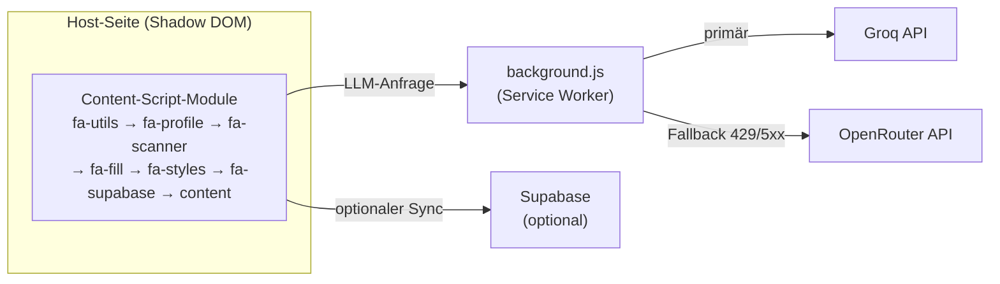

# Technische Architektur

FormAssist ist eine **Manifest-V3-Extension in Vanilla JavaScript — ohne Build-Step**.
Sie ist direkt als „entpackte Erweiterung" ladbar (kein Bundler, keine Transpilation,
keine Laufzeit-Dependencies).

## Überblick

## Modul-Aufbau

Das Content-Script ist in Module aufgeteilt, die das Manifest in **fester Reihenfolge** lädt
(globaler Scope, kein Modulsystem — die Reihenfolge ist verbindlich):

`fa-utils` → `fa-profile` → `fa-scanner` → `fa-fill` → `fa-styles` → `fa-supabase` → `content`

| Datei | Zweck |
|---|---|
| `content.js` | Orchestrierung: Shadow-DOM-UI, Chat, Agent, Guided/Field-by-Field, Profil-Panel, Submit-Review |
| `fa-utils.js` | Hilfsfunktionen: Datums-Parsing, Selektoren, Kendo-Erkennung |
| `fa-profile.js` | `PROFILE_FIELDS` (15 Standardfelder) + `FAKE_DATA` |
| `fa-scanner.js` | Feldanalyse: Label/Hinweis/Fehler, `matchProfile`, `buildSystemPrompt` |
| `fa-fill.js` | `fillField` für alle Feldtypen inkl. Datepicker-Libraries und Temporal-Normalisierung |
| `fa-styles.js` | Aurora-Glass-Stylesheet (`FA_CSS`), in den Shadow Root injiziert |
| `fa-supabase.js` | Optionaler Profil-/History-Sync via Supabase |
| `background.js` | LLM-Transport (Groq + OpenRouter), Retry, Timeout, Streaming, Fallback |

## Leitprinzipien

- **Shadow-DOM-Isolation:** Die gesamte UI läuft in `attachShadow({ mode: 'open' })` —
  kein CSS-/DOM-Leck auf die Host-Seite.
- **Netzwerk nur über den Service Worker:** Content-Scripts machen keine direkten `fetch`-Calls
  an LLM-Provider (CSP-/CORS-sicher); alles läuft über `background.js`.
- **Kein automatisches Absenden:** harte Guardrail im Action-Parser.

## Provider & Fallback

| | Groq | OpenRouter |
|---|---|---|
| Rolle | primär | Backup |
| Standard-Modell | `llama-3.3-70b-versatile` | `openrouter/auto` |
| Fallback-Modell | — | `meta-llama/llama-3.3-70b-instruct:free` |

Antwortet Groq mit **429** (Rate Limit) oder **5xx** und ein OpenRouter-Key ist hinterlegt,
wiederholt `background.js` die Anfrage automatisch über OpenRouter (`MAX_RETRIES = 2`,
retrybare Status `408/409/425/429/500/502/503/504`). Der Nutzer sieht einen kurzen Toast.

## Datenhaltung

- **Lokal (`chrome.storage.local`):** Profile (`faProfiles`), aktives Profil, History,
  Chat-Gedächtnis, Sidebar-Position, Dark-Mode.
- **Synchronisiert (`chrome.storage.sync`):** Provider, API-Keys, Modell, Assistent-Modus,
  optionale Supabase-Zugangsdaten.
- **Optional (Supabase):** geräteübergreifender Sync von Profilen und History
  (`fa-supabase.js`, `supabase_tables.sql`), Geräte-Trennung per `crypto.randomUUID()`.
