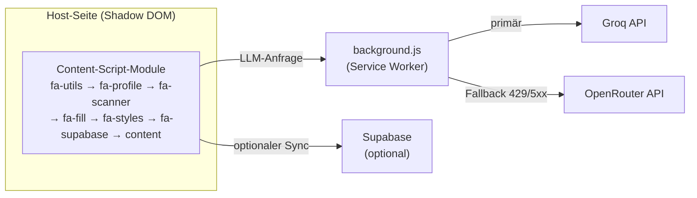

Technologie

# Bewusst einfach gebaut

FormAssist ist eine **Manifest-V3-Extension in Vanilla JavaScript — ohne Build-Step**.
Direkt als „entpackte Erweiterung" ladbar: kein Bundler, keine Transpilation,
keine Laufzeit-Dependencies.

Manifest V3
Vanilla JS
0 Runtime-Dependencies
Shadow DOM
Service Worker

## Überblick

## Modul-Aufbau

Das Content-Script ist in Module aufgeteilt, die das Manifest in **fester Reihenfolge** lädt
(globaler Scope, kein Modulsystem — die Reihenfolge ist verbindlich):

`fa-utils` → `fa-profile` → `fa-scanner` → `fa-fill` → `fa-styles` → `fa-supabase` → `content`

| Datei | Zweck |
|---|---|
| `content.js` | Orchestrierung: Shadow-DOM-UI, Chat, Agent, Guided/Field-by-Field, Profil-Panel, Dokument-Scan, Live-Validierung, Submit-Review |
| `fa-utils.js` | Hilfsfunktionen: Datums-Parsing, Selektoren, Kendo-Erkennung, deterministische Validatoren |
| `fa-profile.js` | `PROFILE_FIELDS` (15 Standardfelder) + `FAKE_DATA` |
| `fa-scanner.js` | Feldanalyse: Label/Hinweis/Fehler, `matchProfile`, `buildSystemPrompt`, rekursiver Shadow-DOM-Scan |
| `fa-fill.js` | `fillField` für alle Feldtypen inkl. Datepicker-Libraries, Temporal-Normalisierung, priorisiertem Select-Matching |
| `fa-styles.js` | Aurora-Glass-Stylesheet (`FA_CSS`), in den Shadow Root injiziert |
| `fa-supabase.js` | Optionaler Profil-/History-Sync via Supabase |
| `background.js` | LLM-Transport (Groq + OpenRouter), Retry, Timeout, Streaming, Fallback |

Prinzipien

## Vier Leitprinzipien

-   :material-select-off:{ .lg .middle } __Shadow-DOM-Isolation__

    ---

    Die gesamte UI läuft in `attachShadow({ mode: 'open' })` —
    kein CSS-/DOM-Leck auf die Host-Seite.

-   :material-server-network:{ .lg .middle } __Netzwerk nur im Service Worker__

    ---

    Content-Scripts machen keine direkten `fetch`-Calls an LLM-Provider
    (CSP-/CORS-sicher); alles läuft über `background.js`.

-   :material-send-lock:{ .lg .middle } __Kein automatisches Absenden__

    ---

    Harte Guardrail im Action-Parser — unabhängig davon, was das Modell vorschlägt.

-   :material-calculator-variant:{ .lg .middle } __Deterministisch vor KI__

    ---

    Mathematische/formatbasierte Prüfungen (z. B. IBAN mod-97) laufen lokal;
    die KI bekommt diese Ergebnisse erst im Submit-Review als Kontext.

## Provider & Fallback

| | Groq | OpenRouter |
|---|---|---|
| Rolle | primär | Backup |
| Standard-Modell | `llama-3.3-70b-versatile` | `openrouter/auto` |
| Fallback-Modell | — | `meta-llama/llama-3.3-70b-instruct:free` |
| Vision-Modell | `meta-llama/llama-4-scout-17b-16e-instruct` | `meta-llama/llama-4-scout` |

Antwortet Groq mit **429** (Rate Limit) oder **5xx** und ein OpenRouter-Key ist hinterlegt,
wiederholt `background.js` die Anfrage automatisch über OpenRouter (`MAX_RETRIES = 2`,
retrybare Status `408/409/425/429/500/502/503/504`). Der Nutzer sieht einen kurzen Toast.
Vision-Requests können ein eigenes `fallbackModel` setzen, damit der Fallback nicht auf
ein text-only Modell wechselt.

Robustheit

## Gebaut für fremde Webseiten

<ul class="fa-checks">
<li>Offene und verschachtelte Shadow Roots werden rekursiv gescannt.</li>
<li>Label-, Hinweis-, Fehler- und Radio-Lookups nutzen den jeweiligen DOM-Root
(<code>getRootNode()</code>) — dadurch funktionieren sie auch in Web Components und
same-origin iFrames.</li>
<li>Legacy-Tabellenlayouts werden unterstützt: die linke Tabellenzelle dient als
Label-Fallback.</li>
<li>Profil-Matching arbeitet am Wortanfang statt mit beliebigen Substrings — das vermeidet
Fehlmatches wie „Hotelname" → Telefon oder „Sportart" → Stadt.</li>
<li><code>fillField()</code> priorisiert exakte Select-Treffer vor Teiltreffern, unterstützt
Mehrfachauswahl, deutsches Dezimalkomma und <code>maxlength</code>.</li>
</ul>

Daten

## Wo welche Daten liegen

-   :material-laptop:{ .lg .middle } __Lokal — `chrome.storage.local`__

    ---

    Profile (`faProfiles`), aktives Profil, History, Chat-Gedächtnis,
    Sidebar-Position, Dark-Mode.

-   :material-sync:{ .lg .middle } __Synchronisiert — `chrome.storage.sync`__

    ---

    Provider, API-Keys, Modell, Assistent-Modus, optionale Supabase-Zugangsdaten.

-   :material-cloud-outline:{ .lg .middle } __Optional — Supabase__

    ---

    Geräteübergreifender Sync von Profilen und History (`fa-supabase.js`,
    `supabase_tables.sql`), Geräte-Trennung per `crypto.randomUUID()`.

